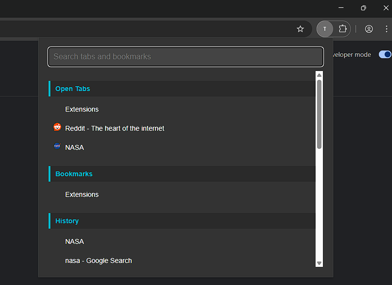
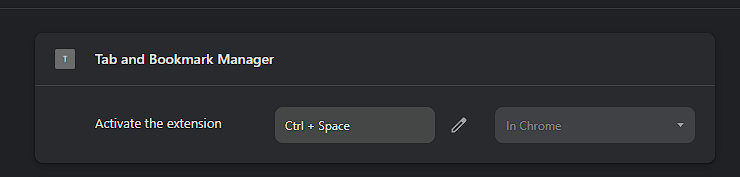

# TabMaster — Chrome Tab and Bookmark Manager

**TabMaster** is a minimalist Chrome extension that brings Vivaldi-style tab and bookmark search to any Chromium browser.

Search, filter, and quickly switch between your open tabs, bookmarks, history, and recently closed tabs — all from a unified popup.

---

## 🚀 Features

- 🔍 Fuzzy search across:
  - Open tabs
  - Bookmarks
  - History
  - Recently closed tabs
- 🎯 Full keyboard navigation (arrow keys + enter)
- 🖱️ Unified scrollbar for smooth navigation
- 📌 Sticky headers to visually separate categories
- 🧩 Lightweight — built with vanilla JS + Fuse.js

> Inspired by **Vivaldi's Quick Command Panel**, but portable and customizable!



---

## 📦 Installation

### Option 1: Load Unpacked Extension

1. Clone this repository:

```bash
git clone https://github.com/renantmagalhaes/tabmaster.git
cd tabmaster
```

2. Visit `chrome://extensions/`
3. Enable **Developer Mode**
4. Click **“Load unpacked”**
5. Select the `tabmaster/` folder

### Option 2: Chrome Web Store (coming soon)

> 🔗 Store link will be added here after publication.

---

## ⌨️ Set a Keyboard Shortcut (Recommended)

To open TabMaster quickly:

1. Go to `chrome://extensions/shortcuts`
2. Find **TabMaster** in the list
3. Assign a keyboard shortcut (e.g. `Ctrl+Shift+Space` or `Alt+T`)

Now you can open the popup instantly without clicking the extension icon.



---
## ⚙️ Customization

### ✨ Appearance

Edit `styles.css` to adjust:

- Colors, fonts, spacing
- Popup size via:

```css
html, body {
  width: 600px;
  min-height: 400px;
}
```

### 🔍 Search Behavior

Adjust `popup.js`:

```js
const options = {
  keys: ['title', 'url'],
  threshold: 0.3, // Fuzziness: lower is stricter
  ...
};
```

### 🔢 Results Count

Change how many items appear per category:

```js
.slice(0, 10) // show first 10 matches
```

---

## 🛠 Built With

- HTML/CSS/JS
- [Fuse.js](https://fusejs.io/) for fuzzy search
- Chrome Extensions API (Manifest V3)

---

## 🧑‍💻 License

MIT License — fork, modify, redistribute.