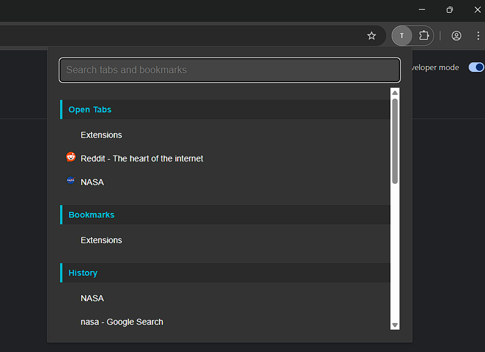
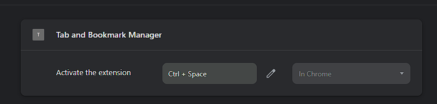

# TabMaster — Chrome Tab and Bookmark Manager

**TabMaster** is a minimalist Chrome extension that brings Vivaldi-style tab and bookmark search to any Chromium browser.

Search, filter, and quickly switch between your open tabs, bookmarks, history, and recently closed tabs — all from a unified popup.

---

## 🚀 Features

- 🔍 Fuzzy search across:
  - Open tabs
  - Bookmarks
  - History
  - Recently closed tabs
- � **Omnibox Address Bar**: Type a URL (e.g., `google.com`) and hit Enter to open it directly if no item is selected.
- 🔎 **Default Search Engine**: Type any text that isn't a URL, and it will search using your default browser engine.
- �🎯 Full keyboard navigation (arrow keys + enter)
- 🖱️ Unified scrollbar for smooth navigation
- 📌 Sticky headers to visually separate categories
- 🧩 Lightweight — built with vanilla JS + Fuse.js

> Inspired by **Vivaldi's Quick Command Panel**, but portable and customizable!



---

## 📦 Installation

### Option 1: Load Unpacked Extension

1. Clone this repository:

```bash
git clone https://github.com/renantmagalhaes/tabmaster.git
cd tabmaster
```

2. Visit `chrome://extensions/`
3. Enable **Developer Mode**
4. Click **“Load unpacked”**
5. Select the `tabmaster/` folder

### Option 2: Chrome Web Store (coming soon)

> 🔗 Store link will be added here after publication.

---

## ⌨️ Set a Keyboard Shortcut (Recommended)

To open TabMaster quickly:

1. Go to `chrome://extensions/shortcuts`
2. Find **TabMaster** in the list
3. Assign a keyboard shortcut (e.g. `Ctrl+Shift+Space` or `Alt+T`)

Now you can open the popup instantly without clicking the extension icon.



---
## ⚙️ Customization

**No coding required!** Click the `⚙️` icon in the popup to open the **Settings Menu**.

### ✨ Appearance
- **Popup Size**: Adjust Width (400px–800px) and Height (200px–600px).
- **Theme**: Customize colors for Background, Text, Accent (Selection), and Items.
  - _Default_: Modern Dark Mode with Zinc Background & Royal Blue Accent.

### 🔍 Search Behavior
- **Fuzziness**: Adjust the slider to make search stricter (0.0) or looser (1.0).

### 💾 Persistence
- All settings are saved automatically to your Chrome profile.
- Use the **"Reset to Defaults"** button to restore the original look instantly.

---

## 🛠 Built With

- HTML/CSS/JS
- [Fuse.js](https://fusejs.io/) for fuzzy search
- Chrome Extensions API (Manifest V3)

## 📁 Project Structure

```text
tabmaster/
├── assets/
│   ├── icons/
│   └── images/
├── docs/
├── src/
│   └── popup/
├── vendor/
├── manifest.json
└── README.md
```

---

## 🧑‍💻 License

MIT License — fork, modify, redistribute.
